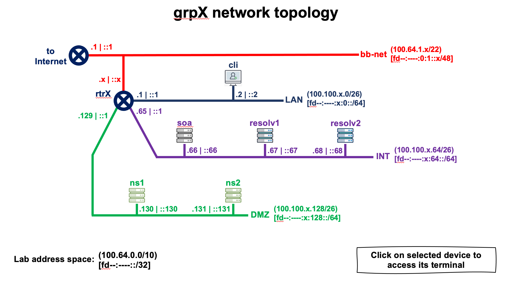

# Topología de Red del Laboratorio (Grupo X) 





```
  DEVICE NAME        IPv4 ADDRESS              IPv6 ADDRESS
+--------------+-----------------------+-----------------------------+
| grpX-resolv1 | 100.100.X.67 (eth0)   | fd1c:9ff7:X:64::67 (eth0)   |
+--------------+-----------------------+-----------------------------+
| grpX-resolv2 | 100.100.X.68 (eth0)   | fd1c:9ff7:X:64::68 (eth0)   |
+--------------+-----------------------+-----------------------------+
| grpX-rtr     | 100.64.1.X (eth0)     | fd1c:9ff7:X::1 (eth1)       |
|              | 100.100.X.65 (eth2)   | fd1c:9ff7:X:64::1 (eth2)    |
|              | 100.100.X.193 (eth4)  | fd1c:9ff7:X:192::1 (eth4)   |
|              | 100.100.X.129 (eth3)  | fd1c:9ff7:X:128::1 (eth3)   |
|              | 100.100.X.1 (eth1)    | fd1c:9ff7:0:1::X (eth0)     |
+--------------+-----------------------+-----------------------------+
```


Durante esta práctica vamos a utilizar solamente los siguientes equipos:

* **grpX-resolv1** & **grpX-resolv2** : servidores DNS recursivos (resolvers)


# Configurar servidor recursivo (BIND)

Para esto vamos a utilizar el servidor "Resolv 1" (resolver) [**grpX-resolv1**].

Este ya tiene pre instalado BIND9, sin ninguna configuración adicional más que la que viene por defecto con la instalación.

Utilizaremos el usuario root:

```
$ sudo su -
```

Vamos al directorio /etc/bind:

```
# cd /etc/bind
```

En este punto debemos configurar algunas opciones de BIND9.
Para ello editamos el archivo /etc/bind/named.conf.options:

```
# nano named.conf.options
```

Ahora agregamos las opciones para indicar (al resolver) cuáles son las direcciones IP que podrán enviar consultas DNS y al mismo tiempo en que interfaces y puerto escuchará nuestro servidor las consultas (tanto para IPv4 como para IPv6). El archivo debe ser el siguiente:

```
options {
	directory "/var/cache/bind";

	// If there is a firewall between you and nameservers you want
	// to talk to, you may need to fix the firewall to allow multiple
	// ports to talk. See http://www.kb.cert.org/vuls/id/800113

	// If your ISP provided one or more IP addresses for stable 
	// nameservers, you probably want to use them as forwarders.  
	// Uncomment the following block, and insert the addresses replacing 
	// the all-0's placeholder.

	// forwarders {
	// 	0.0.0.0;
	// };

	//========================================================================
	// If BIND logs error messages about the root key being expired,
	// you will need to update your keys. See https://www.isc.org/bind-keys
	//========================================================================
	
	dnssec-validation auto;

	listen-on port 53 { any; };																		<--- Add this
	listen-on-v6 port 53 { any; };																<--- Add this
	
	allow-query { localhost; 100.100.0.0/16; fd1c:9ff7::/32; };		<--- Add this

	recursion yes;																								<--- Add this
};
```

Una vez que terminamos de editar el archivo de configuración, ejecutamos un comando que nos permite comprobar rápidamente si la configuración es semánticamente correcta (si el comando no devuelve nada, significa que no encontró errores en los archivos de configuración):

```
# named-checkconf
```

Finalmente reiniciamos el servidor para que tome los cambios de configuración:

```
# systemctl restart bind9
```

Y comprobamos el estado del proceso bind9:

```
# systemctl status bind9
```

Deberíamos obtener una salida similar a la siguiente:

```
● named.service - BIND Domain Name Server
   Loaded: loaded (/lib/systemd/system/named.service; enabled; vendor preset: enabled)
  Drop-In: /etc/systemd/system/service.d
       └─lxc.conf
   Active: **active (running)** since Thu 2021-05-13 01:38:27 UTC; 4s ago
    Docs: man:named(8)
  Main PID: 849 (named)
   Tasks: 50 (limit: 152822)
   Memory: 103.2M
   CGroup: /system.slice/named.service
       └─849 /usr/sbin/named -f -u bind

May 13 01:38:27 resolv1.grpX.<lab_domain>.te-labs.training named[849]: **command channel listening on ::1#953**
May 13 01:38:27 resolv1.grpX.<lab_domain>.te-labs.training named[849]: managed-keys-zone: loaded serial 6
May 13 01:38:27 resolv1.grpX.<lab_domain>.te-labs.training named[849]: zone 0.in-addr.arpa/IN: loaded serial 1
May 13 01:38:27 resolv1.grpX.<lab_domain>.te-labs.training named[849]: zone 127.in-addr.arpa/IN: loaded serial 1
May 13 01:38:27 resolv1.grpX.<lab_domain>.te-labs.training named[849]: zone localhost/IN: loaded serial 2
May 13 01:38:27 resolv1.grpX.<lab_domain>.te-labs.training named[849]: zone 255.in-addr.arpa/IN: loaded serial 1
May 13 01:38:27 resolv1.grpX.<lab_domain>.te-labs.training named[849]: **all zones loaded**
May 13 01:38:27 resolv1.grpX.<lab_domain>.te-labs.training named[849]: **running**
May 13 01:38:27 resolv1.grpX.<lab_domain>.te-labs.training named[849]: managed-keys-zone: Key 20326 for zone . is now trusted (acceptance timer>
May 13 01:38:27 resolv1.grpX.<lab_domain>.te-labs.training named[849]: resolver priming query complete
```


# Pruebas del servidor recursivo


```
# dig @localhost
```

```
; <<>> DiG 9.16.1-Ubuntu <<>> @localhost
; (2 servers found)
;; global options: +cmd
;; Got answer:
;; ->>HEADER<<- opcode: QUERY, status: NOERROR, id: 55915
;; flags: qr rd ra ad; QUERY: 1, ANSWER: 13, AUTHORITY: 0, ADDITIONAL: 27

;; OPT PSEUDOSECTION:
; EDNS: version: 0, flags:; udp: 4096
; COOKIE: 8740b0c9dd1815aa0100000061659efc472f899125a594b4 (good)
;; QUESTION SECTION:
;.				IN	NS

;; ANSWER SECTION:
.			518400	IN	NS	g.root-servers.net.
.			518400	IN	NS	m.root-servers.net.
.			518400	IN	NS	e.root-servers.net.
.			518400	IN	NS	b.root-servers.net.
.			518400	IN	NS	d.root-servers.net.
.			518400	IN	NS	c.root-servers.net.
.			518400	IN	NS	j.root-servers.net.
.			518400	IN	NS	f.root-servers.net.
.			518400	IN	NS	h.root-servers.net.
.			518400	IN	NS	i.root-servers.net.
.			518400	IN	NS	a.root-servers.net.
.			518400	IN	NS	k.root-servers.net.
.			518400	IN	NS	l.root-servers.net.

;; ADDITIONAL SECTION:
m.root-servers.net.	518400	IN	A	202.12.27.33
l.root-servers.net.	518400	IN	A	199.7.83.42
k.root-servers.net.	518400	IN	A	193.0.14.129
j.root-servers.net.	518400	IN	A	192.58.128.30
i.root-servers.net.	518400	IN	A	192.36.148.17
h.root-servers.net.	518400	IN	A	198.97.190.53
g.root-servers.net.	518400	IN	A	192.112.36.4
f.root-servers.net.	518400	IN	A	192.5.5.241
e.root-servers.net.	518400	IN	A	192.203.230.10
d.root-servers.net.	518400	IN	A	199.7.91.13
c.root-servers.net.	518400	IN	A	192.33.4.12
b.root-servers.net.	518400	IN	A	199.9.14.201
a.root-servers.net.	518400	IN	A	198.41.0.4
m.root-servers.net.	518400	IN	AAAA	2001:dc3::35
l.root-servers.net.	518400	IN	AAAA	2001:500:9f::42
k.root-servers.net.	518400	IN	AAAA	2001:7fd::1
j.root-servers.net.	518400	IN	AAAA	2001:503:c27::2:30
i.root-servers.net.	518400	IN	AAAA	2001:7fe::53
h.root-servers.net.	518400	IN	AAAA	2001:500:1::53
g.root-servers.net.	518400	IN	AAAA	2001:500:12::d0d
f.root-servers.net.	518400	IN	AAAA	2001:500:2f::f
e.root-servers.net.	518400	IN	AAAA	2001:500:a8::e
d.root-servers.net.	518400	IN	AAAA	2001:500:2d::d
c.root-servers.net.	518400	IN	AAAA	2001:500:2::c
b.root-servers.net.	518400	IN	AAAA	2001:500:200::b
a.root-servers.net.	518400	IN	AAAA	2001:503:ba3e::2:30

;; Query time: 0 msec
;; SERVER: 127.0.0.1#53(127.0.0.1)
;; WHEN: Tue Oct 12 11:43:08 -03 2021
;; MSG SIZE  rcvd: 851

```


```
# dig @localhost nic.ar
```

```
; <<>> DiG 9.10.6 <<>> nic.ar
;; global options: +cmd
;; Got answer:
;; ->>HEADER<<- opcode: QUERY, status: NOERROR, id: 5186
;; flags: qr rd ra ad; QUERY: 1, ANSWER: 2, AUTHORITY: 0, ADDITIONAL: 1

;; OPT PSEUDOSECTION:
; EDNS: version: 0, flags:; udp: 1232
;; QUESTION SECTION:
;nic.ar.				IN	A

;; ANSWER SECTION:
nic.ar.			3600	IN	A	200.108.146.10
nic.ar.			3600	IN	A	200.108.145.10

;; Query time: 1210 msec
;; SERVER: 192.0.42.53#53(192.0.42.53)
;; WHEN: Thu Jul 06 15:23:12 -03 2023
;; MSG SIZE  rcvd: 67

```


#### Probando DNSSEC

```
# dig @localhost nic.ar +dnssec +multi
```

```
; <<>> DiG 9.10.6 <<>> nic.ar +dnssec +multi
;; global options: +cmd
;; Got answer:
;; ->>HEADER<<- opcode: QUERY, status: NOERROR, id: 54360
;; flags: qr rd ra ad; QUERY: 1, ANSWER: 3, AUTHORITY: 0, ADDITIONAL: 1

;; OPT PSEUDOSECTION:
; EDNS: version: 0, flags: do; udp: 1232
;; QUESTION SECTION:
;nic.ar.			IN A

;; ANSWER SECTION:
nic.ar.			3583 IN	A 200.108.145.10
nic.ar.			3583 IN	A 200.108.146.10
nic.ar.			3583 IN	RRSIG A 8 2 3600 (
				20230804031526 20230705030843 64365 nic.ar.
				gpgbc8q1XkVWgGaZhHv/U5dP9Wl0iwntjrty9s/56ysG
				zKZ1mkvyF7xITfHJjdigJe8WqIrfUz0jwqkqFAd1qbOq
				gop4ReoJ6bjdFU6x7ltu0tbPCz17dDJfjvOZ7A58qmvI
				tV8DeYJihk028zb+icmfF5zKt2oHZy1kpZ0rnZUgD8+G
				mr7ereSPOMz2HHLWOGBPpKcJwWtSmpN/rzAqUBHHWKJP
				ghrpnsG8HDkQzxWAF5y//tkyjoMK6gpGB5LTR8xglikm
				kMROMbdq6hgMp2ZzDo947+9AeJ9yJPiTX/geTXy8CRLJ
				wj87CHLs52t+3zqefEcKHueF4w6IUKZkxA== )

;; Query time: 185 msec
;; SERVER: 192.0.42.53#53(192.0.42.53)
;; WHEN: Thu Jul 06 15:23:29 -03 2023
;; MSG SIZE  rcvd: 361

```


#### Verificando los Resource Records asociados a DNSSEC

```
# dig @localhost nic.ar DNSKEY +dnssec +multi
```

```
; <<>> DiG 9.10.6 <<>> nic.ar DNSKEY +dnssec +multi
;; global options: +cmd
;; Got answer:
;; ->>HEADER<<- opcode: QUERY, status: NOERROR, id: 29415
;; flags: qr rd ra ad; QUERY: 1, ANSWER: 4, AUTHORITY: 0, ADDITIONAL: 1

;; OPT PSEUDOSECTION:
; EDNS: version: 0, flags: do; udp: 1232
;; QUESTION SECTION:
;nic.ar.			IN DNSKEY

;; ANSWER SECTION:
nic.ar.			3596 IN	DNSKEY 256 3 8 (
				AwEAAbB/W6LUj2jx8DaN+NzlPa+xCRrPpRW8JePWPhwf
				gqD1+D+p9tPJeuYblm2bO5zPLBFgL4i4VqvhvndswUnq
				7X9NXIo4eofjZYqJZVqY9ei3LAnNGmoyAAYqs0Z2TLW5
				uNiHZsmAdFXa4/z9bXDyOhzlo2W8avQRjCIK246hvOLD
				CxwXjrak8ZAV/5tFHrXIgCGXBJWbr0c2ZhdfvHgEFf5j
				vImtjVRFzCGgcenVKqGn1BPx0pS7tkv18xTCNueH9Kbz
				I0ROuv3q7X/lUcX5hxQkrSI8rS6hAec/m6XFi4JObwfQ
				BHu73LaKI+tnYcS7rSoV3PXgdaQCXUMMtZsWUG0=
				) ; ZSK; alg = RSASHA256 ; key id = 64365
nic.ar.			3596 IN	DNSKEY 257 3 8 (
				AwEAAas9TNELMenGqlGuYkxWyHtHUNWaxWBZP602Q81E
				v5gaSowx79HoEmZEES5tgIlTqsin/PeNRqJg6KXDDKj/
				3mbpZDYHTq7GLO4CuAq64KfHMGgv7s4W76uhR74qj5EO
				3NjEVNcHt4GKXJvV1F0GvZmUwbcQ8ZVszsnlkajCdvRS
				xzm+GtUREraxOemJZWtSQU2MkUfV+/8k8772Z7z16VW8
				TiEVtUwRHrH6R/sdkPZEXcLu8hIPL9YY8ID5jX5+pB01
				5FdPOSOXNBYr0wxH9AwSnL14st89W7kKJnx37FMsn7mh
				PXvjiQ08fKP+OIhoIrblg5zcssC+ImrDwZg69VXay16C
				MfBbrcKitXfCiwjwO9Oh9jyLDni4xx9N/X/L/0JYncyi
				glHkIuHm8YrT+JrvyEqHmmF71zHX6fZSntxrpysDDS0L
				yqDx2RZp2FB4pKo4EijOmwd/4WnANumPKdYLksVi66x/
				lpwqJ7CwhLIPnKphEPTov1Sewjd7jCrR83c7SpJa3io/
				Zdb0WlRBtA4WflXeeTzKwiZxdInNC+PN93bhQPXFhDND
				j/CvVhVXAN5olk/tigROOhc9G21S+XBQHwPjbmaUavcq
				u19VwJZz6l7f04dpLOYUJOLR+M2sKqWKyRFl3fy0sy1f
				xHqCs+OQjJV90J4dILl/7AEZEIWx
				) ; KSK; alg = RSASHA256 ; key id = 34621
nic.ar.			3596 IN	RRSIG DNSKEY 8 2 3600 (
				20230722052855 20230622045643 34621 nic.ar.
				qfVXaHjLLaIUdFkNJ2SL+kcJMKt7Aa2EzGN95wSRavjr
				2gp4S6yXuojpaq4iL8AxBk8j63nyDluklqoeOImHZbQo
				ahl2HCWrf0I14gLs/hOiHe9vdqXsyH93P7krKszXjFz7
				tYWaY23NKjhSMwq+8yatT9zlHy4Y5kpP6dYli2J63Qov
				VVTpl73XEEO0qmxQ4QDVHNHVto1T54GzFBNP9KVMWvcQ
				bSZUKORugEsNpbmdFM6IYEd/K5+2IA3kAQwNLpvrAYF4
				ojFn7Rhi6pqkoKeLXgwSQEKGTOEg3QDMPH4CVSahZ41I
				iDxBeevTqT2i3KeC7tS3Lk45aY/hdPz01csX0TWF3mlK
				bXdvfzvl+bxjLLgChiTB5wjgIgYF2Zj8ARgFhhWjbSvC
				NLKU6Ni3y7d9QlgVgJ5chSVs0HrlTgwvyehoR0cuwWvU
				JdzCC6t825mk48+WTk724H6DidI89Kr2wHnhGVD7jMXL
				NeCIOGCLCAW8Yt/ldMPRBsQOT1s07J9n8zSWHupAZ2cy
				uPRyVI/+9cKB+HmL/AykNQeL+IE2fdmWsMwVIAygVRLu
				G8swQhAccQXFaq8KhLRsYTQ+HytCCXHnZuuw0ccDMuGG
				IgRgZ1PZUZvinZbO47pHAkffY3ERsA634Un1dEjz7mfC
				olt6qflly2fouR5402UZJDc= )
nic.ar.			3596 IN	RRSIG DNSKEY 8 2 3600 (
				20230722052855 20230622045643 64365 nic.ar.
				Q0IlaP7kEUp5E3rgC2NMsqrOpzCXXYty8IDx6N9azj7E
				bjM5mPDnhMHpa+AStpe8cRvzMzJS/ELKpWWB5juRBo7s
				PXKE6O0pxB4C6EeIzy+EnW+swCB0blpsjdnHPBZgBff8
				SPbGgSuczOZW4EY1lmOOtuGwtJ0uDmUC0rXnMrYIowq1
				4cV0MEx6hAeTo09rn508iNSo1OU+RwSlGJBTPNJ5HGyD
				9y60ZGvf+Oc+uy4x2xQvqBWm2urrS0zTOYuLU/Doqjot
				hAvz7i2Zltx1F1kKJTGQn3kgY8XCc5k9xKhNzZKEqpM4
				YAuK2E1CQ28D+gqx8S6xD9HD49JMNqsHYA== )

;; Query time: 197 msec
;; SERVER: 192.0.42.53#53(192.0.42.53)
;; WHEN: Thu Jul 06 15:25:52 -03 2023
;; MSG SIZE  rcvd: 1687

```


```
# dig @localhost nic.ar DS +multi
```

```
; <<>> DiG 9.10.6 <<>> nic.ar DS +multi
;; global options: +cmd
;; Got answer:
;; ->>HEADER<<- opcode: QUERY, status: NOERROR, id: 37838
;; flags: qr rd ra ad; QUERY: 1, ANSWER: 1, AUTHORITY: 0, ADDITIONAL: 1

;; OPT PSEUDOSECTION:
; EDNS: version: 0, flags:; udp: 1232
;; QUESTION SECTION:
;nic.ar.			IN DS

;; ANSWER SECTION:
nic.ar.			86373 IN DS 34621 8 1 (
				FFC4D319C6AB448D5105E1DF5C368F9AD3F2BCA9 )

;; Query time: 184 msec
;; SERVER: 192.0.42.53#53(192.0.42.53)
;; WHEN: Thu Jul 06 15:27:37 -03 2023
;; MSG SIZE  rcvd: 71

```


#### Generando una excepcion para DNSSEC


Primero realizamos una consulta por un dominio que tiene una firma inválida (sirve para realizar pruebas):

```
# dig @localhost dnssec-failed.org
```

```
; <<>> DiG 9.16.1-Ubuntu <<>> @localhost dnssec-failed.org
; (2 servers found)
;; global options: +cmd
;; Got answer:
;; ->>HEADER<<- opcode: QUERY, status: SERVFAIL, id: 58931
;; flags: qr rd ra; QUERY: 1, ANSWER: 0, AUTHORITY: 0, ADDITIONAL: 1

;; OPT PSEUDOSECTION:
; EDNS: version: 0, flags:; udp: 4096
; COOKIE: 63d65947da7897cb010000006165a11dd39404eb647487aa (good)
;; QUESTION SECTION:
;dnssec-failed.org.		IN	A

;; Query time: 2672 msec
;; SERVER: 127.0.0.1#53(127.0.0.1)
;; WHEN: Tue Oct 12 11:52:13 -03 2021
;; MSG SIZE  rcvd: 74
```


En BIND debemos ingresar la excepción utilizando la herramienta de línea de comando "***rndc nta***"

```
# rndc nta dnssec-failed.org
```


Podemos visualizar una lista de todos los NTA (excepciones) configurados

```
# rndc nta -dump
```


Ahora volvemos a realizar la consulta, luego de ingresar la excepción:

```
# dig @localhost dnssec-failed.org
```

***¿Qué sucede?***

