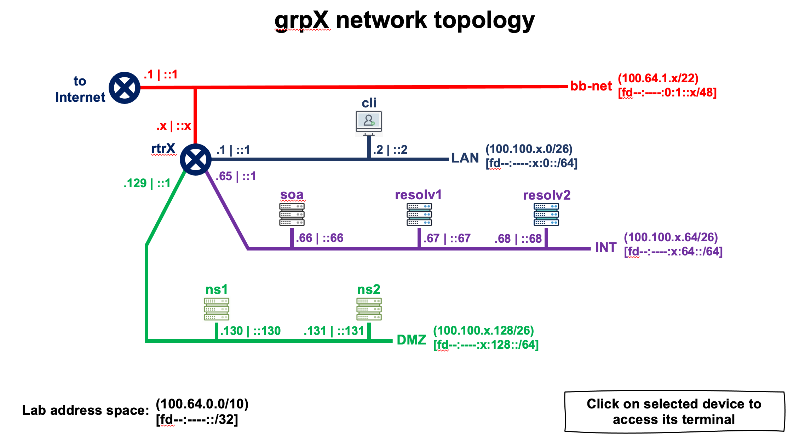

# Topología de Red del Laboratorio (Grupo X) 





```
  DEVICE NAME        IPv4 ADDRESS              IPv6 ADDRESS
+--------------+-----------------------+-----------------------------+
| grpX-resolv1 | 100.100.X.67 (eth0)   | fd1c:9ff7:X:64::67 (eth0)   |
+--------------+-----------------------+-----------------------------+
| grpX-resolv2 | 100.100.X.68 (eth0)   | fd1c:9ff7:X:64::68 (eth0)   |
+--------------+-----------------------+-----------------------------+
| grpX-rtr     | 100.64.1.X (eth0)     | fd1c:9ff7:X::1 (eth1)       |
|              | 100.100.X.65 (eth2)   | fd1c:9ff7:X:64::1 (eth2)    |
|              | 100.100.X.193 (eth4)  | fd1c:9ff7:X:192::1 (eth4)   |
|              | 100.100.X.129 (eth3)  | fd1c:9ff7:X:128::1 (eth3)   |
|              | 100.100.X.1 (eth1)    | fd1c:9ff7:0:1::X (eth0)     |
+--------------+-----------------------+-----------------------------+
```

Durante esta práctica vamos a utilizar solamente los siguientes equipos:

* **grpX-resolv1** & **grpX-resolv2** : servidores DNS recursivos (resolvers)


# Configurar servidor recursivo (Unbound)

Para esto vamos a utilizar el servidor "Resolv 2" (resolver) [**grpX-resolv2**].

Este ya tiene pre instalado Unbound, sin ninguna configuración adicional más que la que viene por defecto con la instalación.

Utilizaremos el usuario root:

```
$ sudo su -
```

Vamos al directorio /etc/unbound:

```
# cd /etc/unbound
```

En este punto debemos configurar algunas opciones de Unbound.
Para ello editamos el archivo /etc/unbound/unbound.conf:

```
# nano unbound.conf
```

Ahora agregamos las opciones para indicar (al resolver) cuáles son las interfaces en las que escuchará consultas, las direcciones IP que podrán enviarle consultas DNS, el puerto que usará (53), y algunos otros parámetros. El archivo debe ser el siguiente:

```
# Unbound configuration file for Debian.
#
# See the unbound.conf(5) man page.
#
# See /usr/share/doc/unbound/examples/unbound.conf for a commented
# reference config file.
#
# The following line includes additional configuration files from the
# /etc/unbound/unbound.conf.d directory.

server:
        interface: 0.0.0.0
        interface: ::0

        access-control: 127.0.0.0/8 allow
        access-control: 100.100.0.0/16 allow
        access-control: fd1c:9ff7::/32 allow

        port: 53

        do-udp: yes
        do-tcp: yes
        do-ip4: yes
        do-ip6: yes

include: "/etc/unbound/unbound.conf.d/*.conf"
```

Una vez que terminamos de editar el archivo de configuración, ejecutamos un comando que nos permite comprobar rápidamente si la configuración es semánticamente correcta:

```
# unbound-checkconf
```

Si es correcto, devolverá algo similar a lo siguiente:

```
unbound-checkconf: no errors in /etc/unbound/unbound.conf
```

Finalmente reiniciamos el servidor para que tome los cambios de configuración:

```
# systemctl restart unbound
```

Y comprobamos el estado del proceso UNBOUND:

```
# systemctl status unbound
```

Deberíamos obtener una salida similar a la siguiente:

```
● unbound.service - Unbound DNS server     Loaded: loaded (/lib/systemd/system/unbound.service; enabled; vendor preset: enabled)    Drop-In: /etc/systemd/system/service.d             └─lxc.conf     Active: active (running) since Thu 2021-05-13 03:49:11 UTC; 13s ago       Docs: man:unbound(8)    Process: 571 ExecStartPre=/usr/lib/unbound/package-helper chroot_setup (code=exited, status=0/SUCCESS)    Process: 574 ExecStartPre=/usr/lib/unbound/package-helper root_trust_anchor_update (code=exited, status=0/SUCCESS)   Main PID: 578 (unbound)      Tasks: 1 (limit: 152822)     Memory: 7.8M     CGroup: /system.slice/unbound.service             └─578 /usr/sbin/unbound -dMay 13 03:49:10 resolv2.grpX.<lab_domain>.te-labs.training unbound[178]: [178:0] info: [25%]=0 median[50%]=0 [75%]=0May 13 03:49:10 resolv2.grpX.<lab_domain>.te-labs.training unbound[178]: [178:0] info: lower(secs) upper(secs) recursionsMay 13 03:49:10 resolv2.grpX.<lab_domain>.te-labs.training unbound[178]: [178:0] info:    0.000000    0.000001 1May 13 03:49:11 resolv2.grpX.<lab_domain>.te-labs.training package-helper[577]: /var/lib/unbound/root.key has contentMay 13 03:49:11 resolv2.grpX.<lab_domain>.te-labs.training package-helper[577]: success: the anchor is okMay 13 03:49:11 resolv2.grpX.<lab_domain>.te-labs.training unbound[578]: [578:0] notice: init module 0: subnetMay 13 03:49:11 resolv2.grpX.<lab_domain>.te-labs.training unbound[578]: [578:0] notice: init module 1: validatorMay 13 03:49:11 resolv2.grpX.<lab_domain>.te-labs.training unbound[578]: [578:0] notice: init module 2: iteratorMay 13 03:49:11 resolv2.grpX.<lab_domain>.te-labs.training unbound[578]: [578:0] info: start of service (unbound 1.9.4).May 13 03:49:11 resolv2.grpX.<lab_domain>.te-labs.training systemd[1]: Started Unbound DNS server.
```


# Pruebas del servidor recursivo


```
# dig @localhost
```

```
; <<>> DiG 9.16.1-Ubuntu <<>> @localhost
; (2 servers found)
;; global options: +cmd
;; Got answer:
;; ->>HEADER<<- opcode: QUERY, status: NOERROR, id: 55915
;; flags: qr rd ra ad; QUERY: 1, ANSWER: 13, AUTHORITY: 0, ADDITIONAL: 27

;; OPT PSEUDOSECTION:
; EDNS: version: 0, flags:; udp: 4096
; COOKIE: 8740b0c9dd1815aa0100000061659efc472f899125a594b4 (good)
;; QUESTION SECTION:
;.				IN	NS

;; ANSWER SECTION:
.			518400	IN	NS	g.root-servers.net.
.			518400	IN	NS	m.root-servers.net.
.			518400	IN	NS	e.root-servers.net.
.			518400	IN	NS	b.root-servers.net.
.			518400	IN	NS	d.root-servers.net.
.			518400	IN	NS	c.root-servers.net.
.			518400	IN	NS	j.root-servers.net.
.			518400	IN	NS	f.root-servers.net.
.			518400	IN	NS	h.root-servers.net.
.			518400	IN	NS	i.root-servers.net.
.			518400	IN	NS	a.root-servers.net.
.			518400	IN	NS	k.root-servers.net.
.			518400	IN	NS	l.root-servers.net.

;; ADDITIONAL SECTION:
m.root-servers.net.	518400	IN	A	202.12.27.33
l.root-servers.net.	518400	IN	A	199.7.83.42
k.root-servers.net.	518400	IN	A	193.0.14.129
j.root-servers.net.	518400	IN	A	192.58.128.30
i.root-servers.net.	518400	IN	A	192.36.148.17
h.root-servers.net.	518400	IN	A	198.97.190.53
g.root-servers.net.	518400	IN	A	192.112.36.4
f.root-servers.net.	518400	IN	A	192.5.5.241
e.root-servers.net.	518400	IN	A	192.203.230.10
d.root-servers.net.	518400	IN	A	199.7.91.13
c.root-servers.net.	518400	IN	A	192.33.4.12
b.root-servers.net.	518400	IN	A	199.9.14.201
a.root-servers.net.	518400	IN	A	198.41.0.4
m.root-servers.net.	518400	IN	AAAA	2001:dc3::35
l.root-servers.net.	518400	IN	AAAA	2001:500:9f::42
k.root-servers.net.	518400	IN	AAAA	2001:7fd::1
j.root-servers.net.	518400	IN	AAAA	2001:503:c27::2:30
i.root-servers.net.	518400	IN	AAAA	2001:7fe::53
h.root-servers.net.	518400	IN	AAAA	2001:500:1::53
g.root-servers.net.	518400	IN	AAAA	2001:500:12::d0d
f.root-servers.net.	518400	IN	AAAA	2001:500:2f::f
e.root-servers.net.	518400	IN	AAAA	2001:500:a8::e
d.root-servers.net.	518400	IN	AAAA	2001:500:2d::d
c.root-servers.net.	518400	IN	AAAA	2001:500:2::c
b.root-servers.net.	518400	IN	AAAA	2001:500:200::b
a.root-servers.net.	518400	IN	AAAA	2001:503:ba3e::2:30

;; Query time: 0 msec
;; SERVER: 127.0.0.1#53(127.0.0.1)
;; WHEN: Tue Oct 12 11:43:08 -03 2021
;; MSG SIZE  rcvd: 851

```


```
# dig @localhost nic.ar
```

```
; <<>> DiG 9.10.6 <<>> nic.ar
;; global options: +cmd
;; Got answer:
;; ->>HEADER<<- opcode: QUERY, status: NOERROR, id: 5186
;; flags: qr rd ra ad; QUERY: 1, ANSWER: 2, AUTHORITY: 0, ADDITIONAL: 1

;; OPT PSEUDOSECTION:
; EDNS: version: 0, flags:; udp: 1232
;; QUESTION SECTION:
;nic.ar.				IN	A

;; ANSWER SECTION:
nic.ar.			3600	IN	A	200.108.146.10
nic.ar.			3600	IN	A	200.108.145.10

;; Query time: 1210 msec
;; SERVER: 192.0.42.53#53(192.0.42.53)
;; WHEN: Thu Jul 06 15:23:12 -03 2023
;; MSG SIZE  rcvd: 67

```


#### Probando DNSSEC

```
# dig @localhost nic.ar +dnssec +multi
```

```
; <<>> DiG 9.10.6 <<>> nic.ar +dnssec +multi
;; global options: +cmd
;; Got answer:
;; ->>HEADER<<- opcode: QUERY, status: NOERROR, id: 54360
;; flags: qr rd ra ad; QUERY: 1, ANSWER: 3, AUTHORITY: 0, ADDITIONAL: 1

;; OPT PSEUDOSECTION:
; EDNS: version: 0, flags: do; udp: 1232
;; QUESTION SECTION:
;nic.ar.			IN A

;; ANSWER SECTION:
nic.ar.			3583 IN	A 200.108.145.10
nic.ar.			3583 IN	A 200.108.146.10
nic.ar.			3583 IN	RRSIG A 8 2 3600 (
				20230804031526 20230705030843 64365 nic.ar.
				gpgbc8q1XkVWgGaZhHv/U5dP9Wl0iwntjrty9s/56ysG
				zKZ1mkvyF7xITfHJjdigJe8WqIrfUz0jwqkqFAd1qbOq
				gop4ReoJ6bjdFU6x7ltu0tbPCz17dDJfjvOZ7A58qmvI
				tV8DeYJihk028zb+icmfF5zKt2oHZy1kpZ0rnZUgD8+G
				mr7ereSPOMz2HHLWOGBPpKcJwWtSmpN/rzAqUBHHWKJP
				ghrpnsG8HDkQzxWAF5y//tkyjoMK6gpGB5LTR8xglikm
				kMROMbdq6hgMp2ZzDo947+9AeJ9yJPiTX/geTXy8CRLJ
				wj87CHLs52t+3zqefEcKHueF4w6IUKZkxA== )

;; Query time: 185 msec
;; SERVER: 192.0.42.53#53(192.0.42.53)
;; WHEN: Thu Jul 06 15:23:29 -03 2023
;; MSG SIZE  rcvd: 361

```


#### Verificando los Resource Records asociados a DNSSEC

```
# dig @localhost nic.ar DNSKEY +dnssec +multi
```

```
; <<>> DiG 9.10.6 <<>> nic.ar DNSKEY +dnssec +multi
;; global options: +cmd
;; Got answer:
;; ->>HEADER<<- opcode: QUERY, status: NOERROR, id: 29415
;; flags: qr rd ra ad; QUERY: 1, ANSWER: 4, AUTHORITY: 0, ADDITIONAL: 1

;; OPT PSEUDOSECTION:
; EDNS: version: 0, flags: do; udp: 1232
;; QUESTION SECTION:
;nic.ar.			IN DNSKEY

;; ANSWER SECTION:
nic.ar.			3596 IN	DNSKEY 256 3 8 (
				AwEAAbB/W6LUj2jx8DaN+NzlPa+xCRrPpRW8JePWPhwf
				gqD1+D+p9tPJeuYblm2bO5zPLBFgL4i4VqvhvndswUnq
				7X9NXIo4eofjZYqJZVqY9ei3LAnNGmoyAAYqs0Z2TLW5
				uNiHZsmAdFXa4/z9bXDyOhzlo2W8avQRjCIK246hvOLD
				CxwXjrak8ZAV/5tFHrXIgCGXBJWbr0c2ZhdfvHgEFf5j
				vImtjVRFzCGgcenVKqGn1BPx0pS7tkv18xTCNueH9Kbz
				I0ROuv3q7X/lUcX5hxQkrSI8rS6hAec/m6XFi4JObwfQ
				BHu73LaKI+tnYcS7rSoV3PXgdaQCXUMMtZsWUG0=
				) ; ZSK; alg = RSASHA256 ; key id = 64365
nic.ar.			3596 IN	DNSKEY 257 3 8 (
				AwEAAas9TNELMenGqlGuYkxWyHtHUNWaxWBZP602Q81E
				v5gaSowx79HoEmZEES5tgIlTqsin/PeNRqJg6KXDDKj/
				3mbpZDYHTq7GLO4CuAq64KfHMGgv7s4W76uhR74qj5EO
				3NjEVNcHt4GKXJvV1F0GvZmUwbcQ8ZVszsnlkajCdvRS
				xzm+GtUREraxOemJZWtSQU2MkUfV+/8k8772Z7z16VW8
				TiEVtUwRHrH6R/sdkPZEXcLu8hIPL9YY8ID5jX5+pB01
				5FdPOSOXNBYr0wxH9AwSnL14st89W7kKJnx37FMsn7mh
				PXvjiQ08fKP+OIhoIrblg5zcssC+ImrDwZg69VXay16C
				MfBbrcKitXfCiwjwO9Oh9jyLDni4xx9N/X/L/0JYncyi
				glHkIuHm8YrT+JrvyEqHmmF71zHX6fZSntxrpysDDS0L
				yqDx2RZp2FB4pKo4EijOmwd/4WnANumPKdYLksVi66x/
				lpwqJ7CwhLIPnKphEPTov1Sewjd7jCrR83c7SpJa3io/
				Zdb0WlRBtA4WflXeeTzKwiZxdInNC+PN93bhQPXFhDND
				j/CvVhVXAN5olk/tigROOhc9G21S+XBQHwPjbmaUavcq
				u19VwJZz6l7f04dpLOYUJOLR+M2sKqWKyRFl3fy0sy1f
				xHqCs+OQjJV90J4dILl/7AEZEIWx
				) ; KSK; alg = RSASHA256 ; key id = 34621
nic.ar.			3596 IN	RRSIG DNSKEY 8 2 3600 (
				20230722052855 20230622045643 34621 nic.ar.
				qfVXaHjLLaIUdFkNJ2SL+kcJMKt7Aa2EzGN95wSRavjr
				2gp4S6yXuojpaq4iL8AxBk8j63nyDluklqoeOImHZbQo
				ahl2HCWrf0I14gLs/hOiHe9vdqXsyH93P7krKszXjFz7
				tYWaY23NKjhSMwq+8yatT9zlHy4Y5kpP6dYli2J63Qov
				VVTpl73XEEO0qmxQ4QDVHNHVto1T54GzFBNP9KVMWvcQ
				bSZUKORugEsNpbmdFM6IYEd/K5+2IA3kAQwNLpvrAYF4
				ojFn7Rhi6pqkoKeLXgwSQEKGTOEg3QDMPH4CVSahZ41I
				iDxBeevTqT2i3KeC7tS3Lk45aY/hdPz01csX0TWF3mlK
				bXdvfzvl+bxjLLgChiTB5wjgIgYF2Zj8ARgFhhWjbSvC
				NLKU6Ni3y7d9QlgVgJ5chSVs0HrlTgwvyehoR0cuwWvU
				JdzCC6t825mk48+WTk724H6DidI89Kr2wHnhGVD7jMXL
				NeCIOGCLCAW8Yt/ldMPRBsQOT1s07J9n8zSWHupAZ2cy
				uPRyVI/+9cKB+HmL/AykNQeL+IE2fdmWsMwVIAygVRLu
				G8swQhAccQXFaq8KhLRsYTQ+HytCCXHnZuuw0ccDMuGG
				IgRgZ1PZUZvinZbO47pHAkffY3ERsA634Un1dEjz7mfC
				olt6qflly2fouR5402UZJDc= )
nic.ar.			3596 IN	RRSIG DNSKEY 8 2 3600 (
				20230722052855 20230622045643 64365 nic.ar.
				Q0IlaP7kEUp5E3rgC2NMsqrOpzCXXYty8IDx6N9azj7E
				bjM5mPDnhMHpa+AStpe8cRvzMzJS/ELKpWWB5juRBo7s
				PXKE6O0pxB4C6EeIzy+EnW+swCB0blpsjdnHPBZgBff8
				SPbGgSuczOZW4EY1lmOOtuGwtJ0uDmUC0rXnMrYIowq1
				4cV0MEx6hAeTo09rn508iNSo1OU+RwSlGJBTPNJ5HGyD
				9y60ZGvf+Oc+uy4x2xQvqBWm2urrS0zTOYuLU/Doqjot
				hAvz7i2Zltx1F1kKJTGQn3kgY8XCc5k9xKhNzZKEqpM4
				YAuK2E1CQ28D+gqx8S6xD9HD49JMNqsHYA== )

;; Query time: 197 msec
;; SERVER: 192.0.42.53#53(192.0.42.53)
;; WHEN: Thu Jul 06 15:25:52 -03 2023
;; MSG SIZE  rcvd: 1687

```


```
# dig @localhost nic.ar DS +multi
```

```
; <<>> DiG 9.10.6 <<>> nic.ar DS +multi
;; global options: +cmd
;; Got answer:
;; ->>HEADER<<- opcode: QUERY, status: NOERROR, id: 37838
;; flags: qr rd ra ad; QUERY: 1, ANSWER: 1, AUTHORITY: 0, ADDITIONAL: 1

;; OPT PSEUDOSECTION:
; EDNS: version: 0, flags:; udp: 1232
;; QUESTION SECTION:
;nic.ar.			IN DS

;; ANSWER SECTION:
nic.ar.			86373 IN DS 34621 8 1 (
				FFC4D319C6AB448D5105E1DF5C368F9AD3F2BCA9 )

;; Query time: 184 msec
;; SERVER: 192.0.42.53#53(192.0.42.53)
;; WHEN: Thu Jul 06 15:27:37 -03 2023
;; MSG SIZE  rcvd: 71

```


#### Generando una excepcion para DNSSEC


Primero realizamos una consulta por un dominio que tiene una firma inválida (sirve para realizar pruebas):

```
# dig @localhost dnssec-failed.org
```

```
; <<>> DiG 9.16.1-Ubuntu <<>> @localhost dnssec-failed.org
; (2 servers found)
;; global options: +cmd
;; Got answer:
;; ->>HEADER<<- opcode: QUERY, status: SERVFAIL, id: 58931
;; flags: qr rd ra; QUERY: 1, ANSWER: 0, AUTHORITY: 0, ADDITIONAL: 1

;; OPT PSEUDOSECTION:
; EDNS: version: 0, flags:; udp: 4096
; COOKIE: 63d65947da7897cb010000006165a11dd39404eb647487aa (good)
;; QUESTION SECTION:
;dnssec-failed.org.		IN	A

;; Query time: 2672 msec
;; SERVER: 127.0.0.1#53(127.0.0.1)
;; WHEN: Tue Oct 12 11:52:13 -03 2021
;; MSG SIZE  rcvd: 74
```


En unbound debemos ingresar la excepción en el archivo de configuración ***unbound.conf***

```
domain-insecure: "dnssec-failed.org"
```


Ahora volvemos a realizar la consulta, luego de ingresar la excepción:

```
# dig @localhost dnssec-failed.org
```

***¿Qué sucede?***


